## Pre-requisites
* Download [Node.js](https://nodejs.org/en/download) (this will also install npm).
* Download [Postman](https://www.postman.com/downloads/).
* Create a [Firebase](https://firebase.google.com/) account if don't have one.

## Project Setup
* Create folder with name `csbc1000_mod7`
* Navigate to `csbc1000_mod7` by running `cd csbc1000_mod7`
* initialize npm project `yarn -y init`
* Install `firebase-tools` by running `yarn add -D firebase-tools`
* Run `yarn firebase login` (on your terminal/command prompt) to connect to your Firebase account
>* Allow Firebase to collect CLI and Emulator Suite usage and error reporting information? n
>* A url in browser will be open which will ask you to login to firebase. Please allow any permissions as prompted.
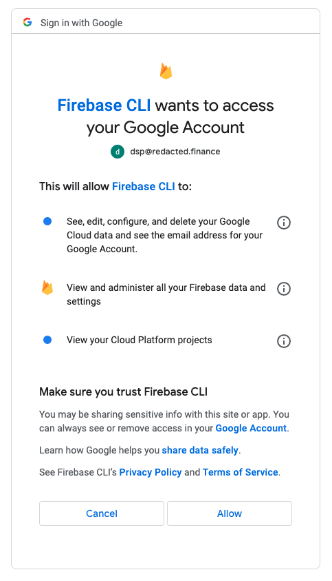
* After successful login you should be able to following message in browser
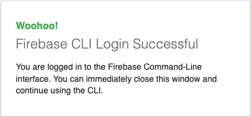 
* You'll also see a success message in terminal
```
✔  Success! Logged in as your@email.com
```
* Create a project using [firebase console](https://console.firebase.google.com) by clicking on **create a project**
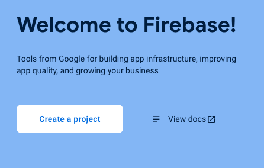
* Provide a name to the project "csbc1000-mod7", agree all terms and press **continue**
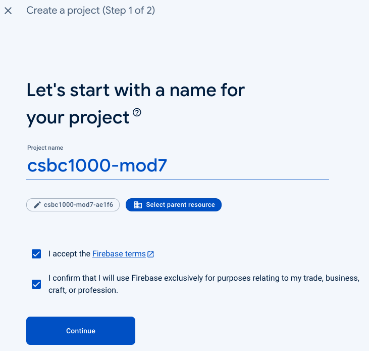
* Enable or Disable google analytics for your firebase project and press **create project**
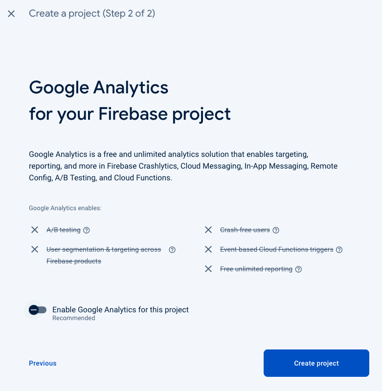
* you'll see prompt that shows progress of project creation
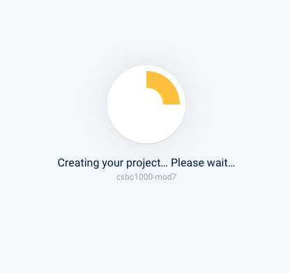
* Once your project, you'll see following message. press **continue**
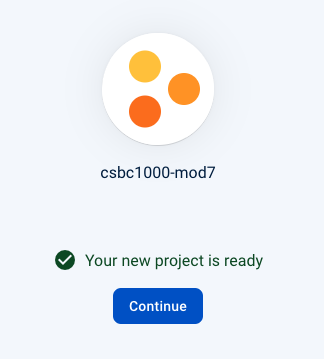
* On the firebase dashboard, click **Project overview**

* Select **cloud firestore**
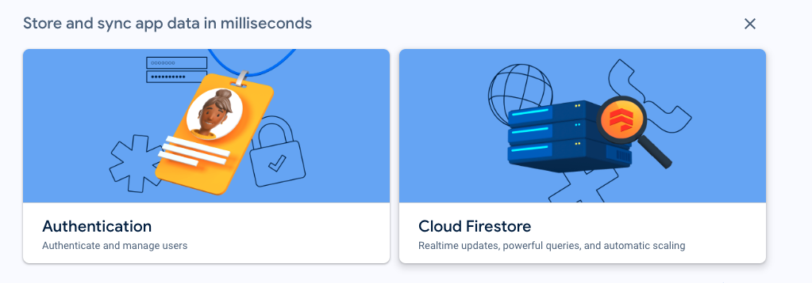
* Press **create database**
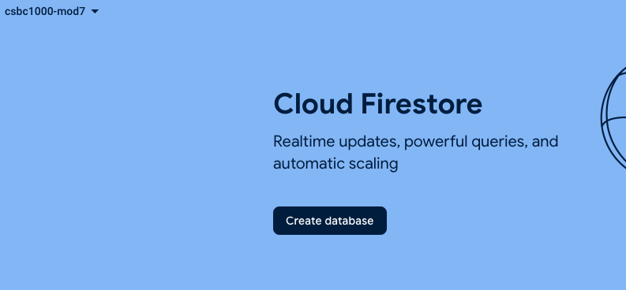
* Set the region based on your location and hit **next**
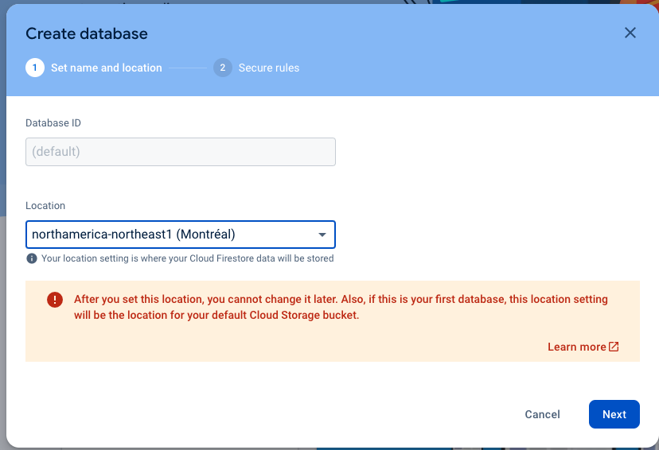
* Select **start in test mode** and hit **next**
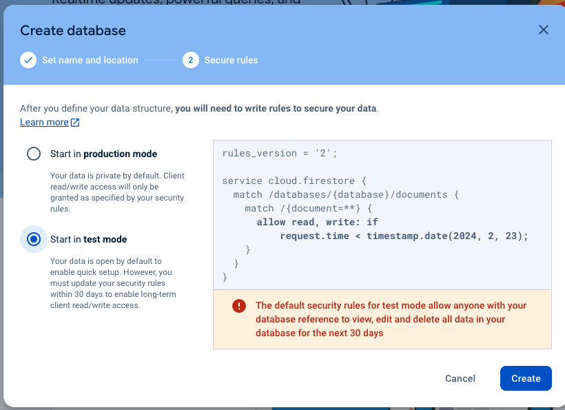
* You'll see a message on provisioning of cloud firestore
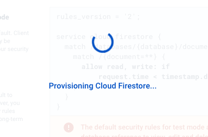
* run `yarn firebase init`
 * select firestore, functions and emulator 
 
 * select `use existing project`
 
 
 * Select `javascript` for Cloud Functions language
 * select `y` for eslint rules
 * select `n` for installing deps with `npm`
  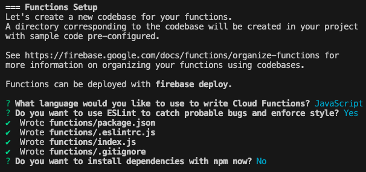
 * setup firebase firestore
 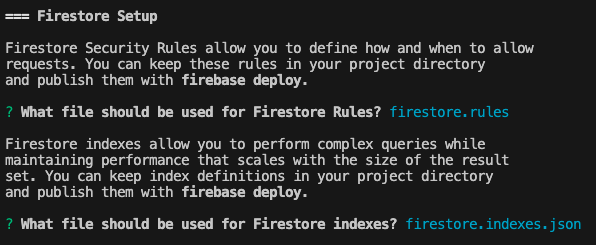
 * select `functions` and `firestore` emulator
 * accept default port for functions emulator
 * accept default port for firestore emulator
 * select `y`for the Emulator UI
 * press enter when prompted for `Which port do you want to use for the Emulator UI (leave empty to use any available port)?`
 * select `y` to download the emulators now
 
* After firebase project is initialized you'll see
```
✔  Firebase initialization complete!
```
* `cd functions` run `yarn add express body-parser uuid`
* run `cd ..` and Let us test the setup by running `yarn firebase emulators:start`
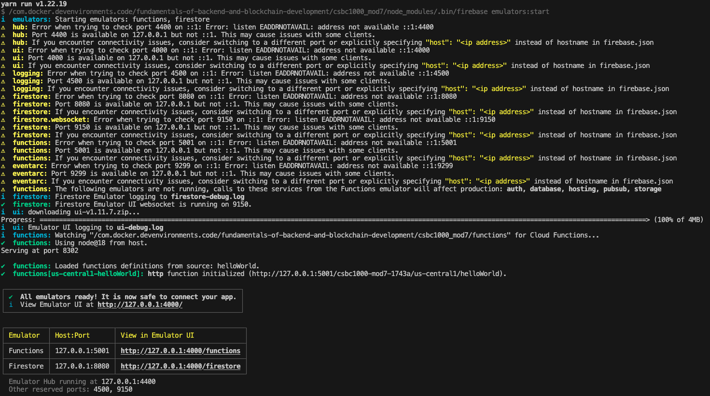
* You should be able to open emulator dashboard on browser. URL of the same can be identified from above image.
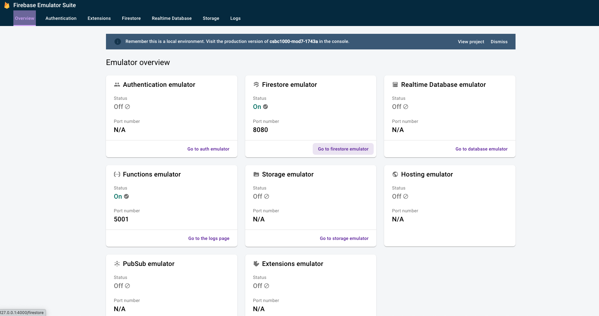
* let us hit API using postman

* now stop the emulator on terminal by hitting ctrl+c
* Replace code inside `functions/index.js` with following
```
/* eslint-disable require-jsdoc */
const functions = require("firebase-functions");
const admin = require("firebase-admin");
const express = require("express");
const bodyParser = require("body-parser");
const {v4: uuidv4} = require("uuid");

// initialize firebase to access services
admin.initializeApp(functions.config().firestore);

// initializing express
const app = express();
const main = express();

main.use("/api/v1", app);
main.use(bodyParser.json());
main.use(bodyParser.urlencoded({extended: false}));

const db = admin.firestore();
const investorCollection = "investors";

const webAPI = functions.https.onRequest(main);

class Investor {
  constructor(id, firstname, lastname, balance, network, assets = {}) {
    this.id = id;
    this.firstname = firstname;
    this.lastname = lastname;
    this.balance = balance;
    this.network = network;
    this.assets = assets;
  }
}


app.post("/investors", async (req, res) => {
  const mockInvestor = new Investor(
      uuidv4(),
      "Vitalik",
      "Buterin",
      1000,
      2000,
      {
        ETH: "200",
        BTC: "200",
      },
  );

  await
  db.collection(investorCollection)
      .doc(mockInvestor.id)
      .set(Object.assign({}, mockInvestor));

  res.status(201).send(`Successfully added investor with ${mockInvestor.id}`);
});

module.exports = {webAPI};
```

* Start the server again by `yarn firebase emulators:start`


* Make sure that firestore emulator will be empty


* let us add some data by hitting `/investors` API using postman
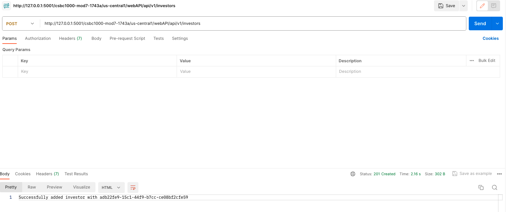

* Verify the data got added inside firestore
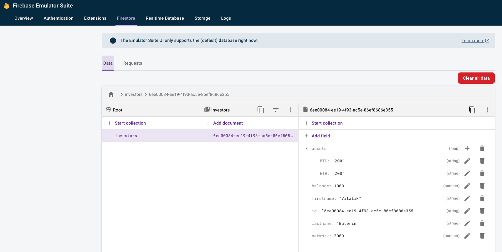